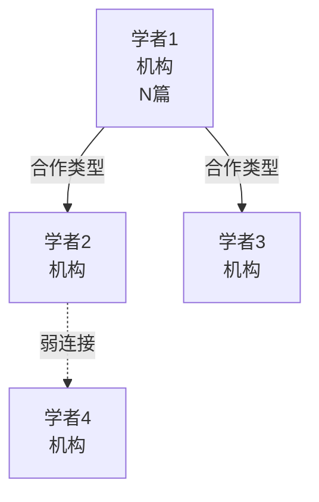

# Scholarly Research Knowledge Base Construction Skill

> 本Skill提供一套经过实战验证的元规则体系，用于系统性地构建循证知识库。涵盖从文献检索、学者发现、知识图谱构建到质量审计的完整5阶段工作流。可平移到医学、兽医学、工程学、社会科学等任何需要循证知识体系的领域。

---

## 核心理念

**双轨并行检索 + 学者锚定优先 + 证据质量守门 + 图增强RAG**

1. **学者优先于关键词**：先找到领域核心学者，再通过其合作网络和引用网络展开，避免关键词检索的遗漏
2. **证据金字塔分层**：T0教科书/指南 → P0多中心队列 → P1单中心 → P2病例报告，层级越高权重越大
3. **质量先于数量**：宁可少而精，不可多而杂；严格执行排除标准
4. **图结构优先于扁平文档**：天然支持多跳推理和关联发现

---

## 工作流总览（5阶段）

```
Phase 1: 需求规划 ──→ 定义范围、主题分类树、知识缺口矩阵
     │
Phase 2: 学者发现 ──→ Tier 1/2/3 分层锚定 + 合作网络图谱
     │
Phase 3: 双轨检索 ──→ Track A(学者追踪) + Track B(主题关键词) + Track C(嵌入召回)
     │
Phase 4: 知识转化 ──→ 全文获取 → GRADE评估 → 结构化笔记 → 图谱连接
     │
Phase 5: 质量审计 ──→ 断链检测 + GRADE一致性 + 孤立节点 + 文献完整性
```

---

## Phase 1: 需求规划 (Requirements Planning)

### 1.1 模块范围定义

**必须输出**：
- 模块名称与编号（如M3体态管理）
- 核心定位（疾病诊断/预防/治疗/评估工具）
- 与其他模块的交叉关系（共病链路图）
- 产品需求驱动矩阵：产品场景 → 知识需求 → 证据深度要求

**模板**：
```markdown
## 模块范围与定位
### 模块定义
[1-2句话说明模块聚焦的知识领域和核心特征]

### 与其他模块的交叉关系
[用Mermaid或文字描述跨模块共病关联]

### 产品需求驱动
| 产品场景 | 知识需求 | 证据深度要求 |
|---------|---------|------------|
| ... | ... | ... |
```

### 1.2 现有知识库审计

**必须执行**：
1. 扫描现有知识库节点，列出已有内容
2. 构建**知识缺口矩阵**：缺口领域 → 当前状态 → 优先级 → 目标文献数
3. 缺口优先级分三级：P0（最高，产品核心依赖）、P1（重要，机制深化）、P2（补充，长期储备）

### 1.3 主题分类树 (Topic Taxonomy)

**构建原则**：
- 采用树状层级结构，深度3-4层为宜
- 叶子节点对应可检索的具体主题
- 每个叶子节点分配唯一ID（如T1.1, T4.3）
- 为每个主题节点标注优先级（P0/P1/P2）和目标文献量

**结构示例**：
```
模块根
├── T1 评估工具
│   ├── T1.1 评分系统
│   ├── T1.2 验证研究
│   └── T1.3 AI/远程评估
├── T2 流行病学
├── T3 病理机制
├── T4 并发症/关联疾病
├── T5 干预/治疗
└── T6 人群/品种特异性
```

---

## Phase 2: 学者发现 (Scholar Discovery)

### 2.1 学者三层分级模型

| 层级 | 定义 | 追踪策略 | 文献追踪深度 |
|------|------|---------|------------|
| **Tier 1 (P0核心)** | ≥10篇相关文献，领域奠基者/指南制定者 | 全量追踪其文献 + 合作网络 + 指导团队 | 全部相关文献，含合作论文 |
| **Tier 2 (P1重要)** | 3-9篇相关文献，关键贡献者 | 追踪代表性论文 + 近3年新作 | 高影响力代表作 |
| **Tier 3 (P2补充)** | 1-2篇高影响力文献 | 仅追踪关键单篇 | 仅关键贡献论文 |

### 2.2 学者锚定方法

**发现路径**（按优先级）：
1. **指南/共识作者名单**：临床指南的执笔人和委员会成员 → 天然Tier 1
2. **教科书章节作者**：权威教材对应章节作者 → 领域权威
3. **高被引论文第一/通讯作者**：通过PubMed/Google Scholar按被引排序 → 重要贡献者
4. **学术组织核心成员**：如WSAVA、ICADA、ISCAID等专业委员会成员
5. **引用网络滚雪球**：从Tier 1学者的论文参考文献和被引文献中发现

**每个Tier 1学者必须记录**：
- 姓名、当前机构、国家
- 研究方向关键词
- PubMed相关文献数（估算H-index）
- 代表性论文清单（年份、标题、期刊、PMID、对应主题ID）
- 主要合作者名单

### 2.3 学者合作网络图谱

**使用Mermaid绘制合作网络**，标注：
- 核心节点（Tier 1学者）用加粗/大节点
- 合作关系类型（导师-学生、长期合作、跨机构）
- 机构声望（顶尖院校/一般院校/企业）
- 网络拓扑类型：星型（单一领导者）vs 网状（多中心协作）

**模板**：


---

## Phase 3: 双轨检索 (Dual-Track Retrieval)

### 3.1 Track A: 学者锚定检索

**执行顺序**：Tier 1 → Tier 2 → Tier 3

**检索方法**：
- PubMed作者检索：`作者姓名[Author] AND 领域关键词[tiab]`
- 按时间倒序排列，优先获取近5年文献
- 通过"Similar articles"和"Cited by"扩展
- 追踪学者个人主页/ResearchGate/Google Scholar的完整发表列表

**关键原则**：
- Tier 1学者的全部相关文献必须进入初筛池
- 注意学者姓名变体（如Bjørnvad vs Bjornvad）
- 通过机构信息确认作者身份（避免同名混淆）

### 3.2 Track B: 主题关键词检索

#### PubMed检索式设计规范

**MeSH词 + 自由词组合策略**：
1. 每个主题子树对应1组检索式
2. 同时使用MeSH主题词和[tiab]标题/摘要自由词
3. 物种限定：`(dog[tiab] OR dogs[tiab] OR canine[tiab])`（按领域调整）
4. 研究类型限定（可选）：`(cohort[tiab] OR "cross-sectional"[tiab] OR "randomized controlled trial"[pt])`

**检索式模板**：
```pubmed
# [主题ID] [主题名称]
(MeSH术语[MeSH Terms] OR 自由词1[tiab] OR 自由词2[tiab] OR 缩写[tiab])
AND (疾病/现象关键词[tiab])
AND (物种限定[tiab])
AND (研究类型限定[tiab] - 可选)
```

**MeSH词表使用策略**：
- 先在PubMed MeSH Browser查找规范术语
- 组配方式：`疾病/并发症`、`疾病/流行病学`、`疾病/遗传学`等子主题
- 自由词覆盖：缩写、同义词、新旧术语变体

#### 期刊质量守门（检索阶段即执行）

**期刊分层表**（可按领域调整）：

| 层级 | 处理策略 |
|------|---------|
| **Tier S（顶刊）** | 直接纳入P0候选 |
| **Tier A（领域权威）** | 纳入P1候选 |
| **Tier B（质量尚可）** | 逐篇评估后纳入P1/P2 |
| **Tier C（需谨慎）** | 仅限高被引且方法学严谨者 |
| **⚠️ 警惕名单** | 仅限方法学确实创新且被引>阈值者，否则舍弃 |
| **❌ 排除名单** | **直接舍弃，不进入初筛** |

**通用排除名单（可按领域扩展）**：
- MDPI旗下多数期刊（高自引、审稿周期极短）
- 未经同行评审的预印本平台（TechRxiv等）
- 无DOI的会议论文摘要
- 学位论文（内容已被期刊论文覆盖时）
- predatory journals（掠夺性期刊）

**质量红旗（Red Flags）检查清单**：
- ⚠️ 审稿周期极短（<30天）
- ⚠️ 准确率/AUC过于完美（>0.99需警惕数据泄露）
- ⚠️ 外部验证不透明
- ⚠️ 输入模态与产品场景不匹配
- ⚠️ 样本量极小（n<5的case report除非独特否则排除）
- ⚠️ 作者声明的利益冲突（企业资助需标注）

### 3.3 Track C: 嵌入数据库语义召回

**语义关键词矩阵**按维度组织：

| 语义维度 | 核心关键词 | 扩展同义词 | 语义近似词 |
|---------|-----------|-----------|-----------|
| 核心实体 | ... | ... | ... |
| 疾病关联 | ... | ... | ... |
| 干预方法 | ... | ... | ... |
| 人群/品种 | ... | ... | ... |

**语义召回查询模板**：
- 每个P0主题至少准备2-3个自然语言查询模板
- 查询应包含完整的研究语境，而非孤立关键词
- 示例：`"[干预方法]对[疾病]在[人群]中的[结局]影响，[研究设计]验证"`

### 3.4 检索结果融合与去重

1. 三轨结果合并到统一候选池
2. 按PMID/DOI去重
3. 标题/摘要初筛：剔除与主题无关、明显低质量、不符合纳入标准的文献
4. 按主题ID分类，检查每个主题的文献量是否达标
5. 生成下载清单，标注优先级（T0/P0/P1/P2）

---

## Phase 4: 知识转化 (Knowledge Transformation)

### 4.1 全文获取策略

| 文献类型 | 获取方式 | 格式优先级 |
|---------|---------|-----------|
| OA开放获取 | Europe PMC REST API (`/rest/{pmcid}/fullTextXML`) | JATS XML > PDF |
| 订阅制文献 | DOI定位 → 机构订阅/馆际互借 → 手动下载 | PDF |
| 临床指南 | 官方学会网站直接下载 | PDF |
| 教科书 | 商业购买/图书馆借阅 | PDF（提取相关章节） |

**OA文献自动获取**：优先使用Europe PMC API获取JATS XML结构化全文，便于后续解析。

**反爬虫处理**：Wiley等出版社OA文献可能需要浏览器手动下载，记录DOI/URL供后续操作。

### 4.2 证据分级评估 (GRADE)

#### 四级证据金字塔

| 层级 | 证据类型 | GRADE | 临床权重 | 获取优先级 |
|------|---------|-------|---------|-----------|
| **T0** | 教科书/权威机构临床指南 | ⊕⊕⊕⊕ 高 | 可直接采纳 | 最高 |
| **P0** | 多中心队列/高质量诊断研究/顶刊论文 | ⊕⊕⊕◯ 中 | 高度可信 | 高 |
| **P1** | 单中心队列/病例对照/领域综述 | ⊕⊕◯◯ 低 | 需谨慎解读 | 中 |
| **P2** | 病例报告/预印本/体外实验 | ⊕◯◯◯ 极低 | 仅作参考 | 低 |

#### GRADE升降级规则

**降级因素（每项-1级）**：
- 偏倚风险（研究设计缺陷）
- 不一致性（研究间异质性大）
- 间接性（人群/干预/结局与目标场景不同）
- 不精确性（置信区间过宽）
- 发表偏倚

**升级因素（每项+1级）**：
- 大效应量（RR>2或<0.5）
- 剂量-反应关系
- 残余混杂反向效应

**重要原则**：
- Editorial/Comment/Letter不是正式指南，必须降级
- 作者权威但发在低质量期刊的文章，按期刊质量降级而非按作者权威升级
- 体外实验/动物实验不能直接外推为临床建议
- 比教科书发表早的论文，其核心发现大概率已被教科书涵盖，仅保留有独特数据集的

### 4.3 Obsidian知识库结构（双层图）

#### 目录组织规范

```
vault/
├── 01_Knowledge_Framework/    # 框架层：MOC、证据标准、方法论
│   ├── Evidence_Grading.md
│   ├── Evidence_Pyramid.md
│   ├── MOC_*.md               # Map of Content（知识地图）
│   └── ...
├── 0X_[模块名]/               # 各模块知识节点
│   ├── _[指南名].md           # 指南原文笔记（_前缀表示原文参考）
│   ├── [疾病/主题名].md       # 结构化知识节点
│   └── _raw/                  # 原始文本提取（可选）
├── 07_References/             # 参考层
│   ├── Literature_Index.md    # 完整文献索引
│   └── Scholar_Network.md     # 学者合作网络
└── 00_INDEX.md                # 总入口
```

#### 节点类型与Frontmatter规范

| 节点类型 | 命名规范 | 必需Frontmatter字段 |
|---------|---------|-------------------|
| MOC地图节点 | `MOC_*.md` | title, tags: [MOC] |
| 疾病/主题节点 | `[Topic_Name].md`（蛇形命名） | title, tags, module, [domain-specific fields] |
| 指南原文节点 | `_[Guideline_Name].md`（_前缀） | title, tags: [reference, guideline], source, year |
| 品种/人群档案 | `[Breed_Name].md` | title, tags: [breed/population], predispositions |
| 评估工具节点 | `[Tool_Name].md` | title, tags: [assessment], validation |

**疾病节点Frontmatter示例**：
```yaml
---
title: 疾病名称
tags:
  - disease
  - [module_name]
module: M1/M2/M3
breeds: [易感品种列表]
urgency: emergency/high/medium/low
evidence_grade: T0/P0/P1/P2
---
```

#### 知识节点内容模板

```markdown
---
[frontmatter]
---

# [节点标题]

## 定义
[what it is - 1-2句话准确定义]

## 易感人群/风险因子
[predisposed individuals - 品种/年龄/性别/其他风险因素]

## 定义性特征
[defining characteristics - 核心临床表现/诊断标准]
> [!vision] 视觉识别特征
> - [图像可见的特征列表]

## 临床意义与机制
[clinical significance - know-why核心机制]
### 并发症
[complications - 因果关联的下游疾病]

## 诊断与鉴别
[diagnosis - 诊断方法]
### 鉴别诊断
| 疾病 | 关键鉴别点 |
|------|-----------|
| ... | ... |
### 分级/评分
[grading systems - 严重程度分级]

## 处置原则
[treatment - 治疗/干预原则]
### 禁忌
[!] 安全红线：[绝对禁忌，如角膜溃疡禁用激素]

## 预后
[prognosis - 预后判断]

## 转诊标准
[referral criteria - 何时必须转诊]

> [!info] 证据来源
> - T0: [[_指南名]]、[[_教科书章节]]
> - P0: [作者 年份] (PMID: xxx)
> - P1: [作者 年份] (PMID: xxx)
>
> [!info] 证据质量
> - **GRADE**: ⊕⊕⊕◯（中等）
> - **升降级理由**: ...
```

#### Wikilink建立规范

1. **每个知识节点必须至少连接**：
   - 1个MOC地图节点
   - 1个以上相关疾病/主题节点
2. **跨模块链接必须建立**：共病关联（如肥胖→糖尿病→白内障）
3. **双向链接检查**：A链接B时，考虑B是否需要回链A
4. **链接粒度**：链接到具体笔记，必要时链接到section（`[[笔记名#章节名]]`）

### 4.4 结构化知识库产物（YAML/JSON）

对于需要被代码/规则引擎直接消费的知识，输出为YAML格式：

```yaml
diseases:
  - id: disease_001
    name: "疾病名称"
    what_it_is: "定义"
    predisposed_individuals:
      breeds: ["品种1", "品种2"]
      age_range: "..."
    defining_characteristics:
      clinical_signs: ["体征1", "体征2"]
      image_recognition_labels: ["视觉特征1", "视觉特征2"]
    clinical_significance:
      key_know_why: "核心机制"
      complications: ["并发症1", "并发症2"]
    diagnosis:
      methods: ["诊断方法1"]
      differential_diagnosis: ["鉴别1", "鉴别2"]
      grading: "分级体系描述"
    treatment:
      principles: ["治疗原则"]
      contraindications: ["绝对禁忌"]
    prognosis: "预后描述"
    referral_criteria: ["转诊标准"]
```

**安全规则引擎**（确定性硬约束，不依赖LLM）：
```yaml
safety_rules:
  - id: SR001
    description: "角膜溃疡禁用皮质类固醇"
    condition: "diagnosis contains 'corneal ulcer'"
    contraindication: "corticosteroids"
    severity: critical
```

---

## Phase 5: 质量审计 (Quality Audit)

### 5.1 六大审计检查项

| Task | 检查内容 | 通过标准 |
|------|---------|---------|
| **5.1 断链检测** | 扫描所有wikilink，验证目标文件存在 | 0断链 |
| **5.2 GRADE一致性** | 每条文献引用标注GRADE等级；升降级理由充分 | 所有文献已分级；无editorial冒充指南 |
| **5.3 文献完整性** | vault引用文献 vs 实际PDF/XML交叉比对 | 引用文献100%可追溯 |
| **5.4 孤立节点检测** | 分析wikilink网络连接度 | 每个节点至少连1个MOC+1个相关节点；0孤立节点 |
| **5.5 Frontmatter一致性** | 验证所有节点必填字段存在且格式正确 | 100%符合模板规范 |
| **5.6 跨模块链接** | 共病关联的跨模块wikilink已建立 | 共病矩阵中的所有关联已建立链接 |

### 5.2 审计报告模板

```markdown
# Phase 5 质量审计报告

## 基本信息
- 模块：[模块名]
- 审计日期：[日期]
- 新增节点数：N
- 新增文献数：M

## 检查结果
| 检查项 | 结果 | 发现问题数 | 修复状态 |
|--------|------|-----------|---------|
| 5.1 断链检测 | ✅/⚠️/❌ | N | 已修复/待修复 |
| 5.2 GRADE一致性 | ... | ... | ... |
| 5.3 文献完整性 | ... | ... | ... |
| 5.4 孤立节点 | ... | ... | ... |
| 5.5 Frontmatter | ... | ... | ... |
| 5.6 跨模块链接 | ... | ... | ... |

## 问题清单与修复记录
[逐条列出发现的问题和修复方案]

## 知识图谱统计
- 总节点数：N
- 总wikilink数：M
- 网络密度：...
- 跨模块链接数：K
```

---

## 知识检索架构（Graph-augmented RAG）

### 语料三层分类

| 类型 | 格式 | 处理方式 | 用途 |
|------|------|---------|------|
| **A类：结构化规则** | YAML/JSON | 解析为代码/配置，不进RAG | 安全规则、疾病关联、分类标签 → 确定性工具 |
| **B类：半结构化临床知识** | Obsidian .md | Graph RAG核心检索源 | Agent推理的know-why燃料；wiki links构成L1层图 |
| **C类：原始文献** | PDF/JATS XML | 解析摘要进RAG；全文后置 | 原始证据溯源 |

### 双层图结构

- **L1层（文档级图）**：基于Obsidian wiki links构建。节点=笔记，边=wikilink。人工策展，质量高。
- **L2层（实体级图）**：从笔记正文中抽取医学实体（疾病、症状、药物、病原体、品种）及关系。增量构建细粒度关联。

### 检索策略

1. 查询进入 → 向量检索返回语义匹配的chunk（按header section切分）
2. 同时在L1+L2图上进行1-2跳多跳推理，返回关联实体的chunk
3. 两路结果合并后送入Agent的ReAct循环

### Chunking策略

按Markdown header section切分，每个chunk携带：
- Frontmatter元数据（疾病名/模块/紧急度）
- Section标题
- Section内容
- 保留wiki links作为L1层边

---

## 交付物清单

每个模块完成时必须交付：

| 阶段 | 交付物 | 文件位置 |
|------|--------|---------|
| Phase 1 | 需求规划文档 | `[module]/docs/[M#]_Requirements_Document.md` |
| Phase 2 | 学者锚定报告（含合作网络图谱） | 需求文档第四章 + `vault/07_References/Scholar_Network.md` |
| Phase 3 | 检索式文档 + 下载清单 + 下载报告 | `[module]/docs/[M#]_Download_Report.md` |
| Phase 4 | Vault知识节点 + 结构化YAML知识库 | `vault/0X_[module]/` + `[module]/[M#]_knowledge_base.yaml` |
| Phase 5 | 质量审计报告 | `[module]/[M#]_quality_report.md` + `[module]/[M#]_literature_audit.md` |
| 全流程 | 文献索引（元数据+GRADE分级） | `vault/07_References/Literature_Index.md` |

---

## 领域适配指南

将本Skill平移到新领域时，需要调整：

1. **期刊分层表**：根据目标领域的期刊声誉重新划分Tier S/A/B/C/排除名单
2. **证据金字塔**：根据领域特点调整各层级的研究类型定义（如人医RCT权重更高，工程学可能更看重benchmark）
3. **MeSH词/关键词**：替换为目标领域的规范术语
4. **节点Frontmatter字段**：根据领域需求定制（如疾病节点可替换为技术节点、产品节点等）
5. **安全规则模板**：根据领域的合规红线定制硬约束规则
6. **学术组织名单**：替换为目标领域的权威学术组织

**不需要调整的核心元规则**：
- 5阶段工作流顺序
- 学者三层分级模型
- 双轨检索（学者+关键词+嵌入）策略
- GRADE升降级方法论
- 双层图知识库结构
- 六大质量审计检查项

---

## 反模式（请勿这样做）

1. ❌ 从关键词检索开始而不先锚定学者 → 会遗漏大量高价值文献
2. ❌ 按IF阈值一刀切筛选期刊 → 会误杀专业领域顶刊（如兽医Ophthalmology虽IF低但领域权威）
3. ❌ 先收集文献再评估质量 → 浪费时间在低质量文献的获取和阅读上
4. ❌ 扁平存储文档而不建立wikilink → 丧失多跳推理能力，退化为普通RAG
5. ❌ 信任知名作者发在水刊上的文章 → 作者权威不代表期刊质量
6. ❌ P2病例报告用来支撑临床建议 → 极低质量证据只能作为参考
7. ❌ editorial/comment当指南用 → 必须降级
8. ❌ 孤立节点无连接 → 知识图谱成为信息孤岛
9. ❌ 不做质量审计就交付 → 断链和不一致会在Agent推理时造成严重错误
