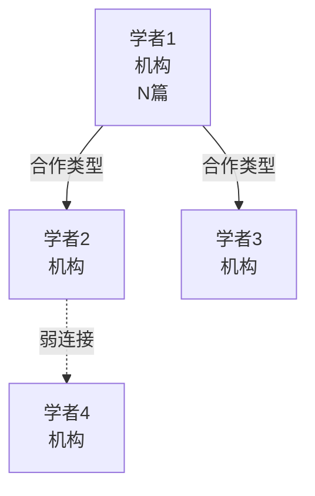

# [M#] [模块名称]：语料准备需求文档

> **版本**: v1.0
> **日期**: [YYYY-MM-DD]
> **模块**: [模块编号] [模块名称]
> **前置条件**: [前置模块完成状态]
> **核心目标**: [1-2句话说明本模块核心目标]
> **适用流程**: Phase 1（需求规划）→ Phase 2（学者发现）→ 嵌入数据库深度召回

---

## 一、模块范围与定位

### 1.1 模块定义

[模块聚焦的知识领域和核心特征说明。区别于其他模块的独特性：如预防导向/治疗导向、量化评估/影像诊断、系统关联等]

### 1.2 与其他模块的交叉关系

```
[用Mermaid绘制共病关联图]
M1 XXX ──┐
           ├── [共病链路1]
M2 XXX ──┤── [共病链路2]
           └── [共病链路3]
M3 XXX ──┤── [共病链路4]
```

### 1.3 产品需求驱动

| 产品场景 | 知识需求 | 证据深度要求 |
|---------|-----------|------------|
| [场景1] | [具体知识需求] | [A/B/C级，或T0/P0/P1/P2] |
| [场景2] | ... | ... |

---

## 二、现有知识库审计

### 2.1 已有节点

| 节点 | 内容状态 | 文献支撑 | 知识缺口 |
|------|---------|---------|---------|
| `[节点名].md` | [完整/部分/空] | [已有文献作者年份] | [缺口描述] |

### 2.2 知识缺口矩阵

| 缺口领域 | 当前状态 | 需补强优先级 | 目标文献数 |
|----------|---------|------------|-----------|
| [领域1] | [无/概念性提及/部分数据] | P0/P1/P2 | N篇 |
| **合计** | [X节点/Y篇文献] | — | **N-M篇** |

---

## 三、研究主题分类法

### 3.1 主题树（Topic Taxonomy）

```
[M#] [模块名称]
├── T1 [主题分类1]
│   ├── T1.1 [子主题1]
│   ├── T1.2 [子主题2]
│   └── T1.3 [子主题3]
├── T2 [主题分类2]
│   ├── T2.1 [子主题]
...
└── T7 [主题分类7]
```

### 3.2 优先级排序

| 优先级 | 主题 | 理由 | 目标文献量 |
|--------|------|------|-----------|
| **P0** | T[X] | [产品核心需求/最大缺口] | N篇 |
| **P1** | T[X] | [机制深化/重要补充] | N篇 |
| **P2** | T[X] | [长期储备] | N篇 |

---

## 四、学者群体锚定

### 4.1 学者分层模型

（遵循Skill定义的Tier 1/2/3三层分级）

### 4.2 P0 核心学者（Tier 1）

#### 4.2.1 [学者姓名]（[机构], [国家]）

| 字段 | 内容 |
|------|------|
| **机构** | [大学/机构名称] |
| **角色** | [领域定位：如全球领导者/奠基者/指南核心成员] |
| **PubMed相关文献数** | N篇（检索式: `[姓名] [领域关键词]`） |
| **H-index（估算）** | >N |
| **研究方向** | [关键词列表] |

**代表性论文清单：**

| 年份 | 标题 | 期刊 | PMID | iPaw主题 | 优先级 | 质量审查 |
|------|------|------|------|---------|--------|---------|
| YYYY | [标题] | [期刊名] | [PMID] | T[X.X] | P0/P1/P2 | ✅纳入/⚠️降级/❌排除 |

**追踪策略：**
- [具体追踪策略]

[重复以上结构列出所有Tier 1学者]

### 4.3 P1 重要学者（Tier 2）

| 序号 | 学者 | 机构 | 核心贡献 | 追踪重点 |
|------|------|------|---------|---------|
| 1 | [姓名] | [机构] | [贡献描述] | [追踪内容] |

### 4.4 P2 补充学者（Tier 3）

| 学者 | 领域 | 关键文献 | 用途 |
|------|------|---------|------|

### 4.5 学者合作网络图谱



---

## 五、检索策略设计

### 5.1 分主题PubMed检索式

```pubmed
# T[X.X] [主题名称]
(MeSH术语[MeSH Terms] OR 自由词1[tiab] OR 自由词2[tiab])
AND (领域关键词[tiab])
AND (物种/人群限定[tiab])
```

[为每个P0/P1主题提供检索式]

### 5.2 MeSH词表策略

| MeSH词 | 组配 | 用途 |
|--------|------|------|

### 5.3 嵌入数据库语义召回关键词矩阵

| 语义维度 | 核心关键词 | 扩展同义词 | 语义近似词 |
|---------|-----------|-----------|-----------|

**语义召回查询模板：**
1. `"[自然语言查询1]"`
2. `"[自然语言查询2]"`

---

## 六、文献优先级分级标准

### 6.1 T0级（最高优先级）：教材著作与临床指南

#### T0-A 教材著作

| # | 教材 | 作者 | 版本/年份 | 出版社 | iPaw用途 |
|---|------|------|----------|--------|---------|

#### T0-B 临床指南与专家共识

| # | 指南 | 发布机构 | 年份 | OA状态 | iPaw用途 |
|---|------|---------|------|--------|---------|

### 6.2 P0/P1/P2级标准

（遵循Skill中定义的标准，可按领域微调）

### 6.3 排除标准

（遵循Skill中定义的通用排除名单 + 领域特定排除）

### 6.4 期刊质量分层表

| 层级 | 期刊 | 处理策略 |
|------|------|---------|
| **Tier S** | [顶刊列表] | 直接纳入P0 |
| **Tier A** | [领域权威列表] | 纳入P1 |
| **Tier B** | [质量尚可列表] | 逐篇评估 |
| **⚠️ 警惕** | [警惕名单] | 严格筛选 |
| **❌ 排除** | [排除名单，含MDPI等] | 直接舍弃 |

---

## 七、预期Vault知识图谱扩展

### 7.1 新增节点规划

```
0[X]_[模块名]/
├── [已有节点1].md          [已有] ← [补充说明]
├── [已有节点2].md          [已有] ← [补充说明]
├── [新节点1].md              [新建] T[X.X] [描述]
├── [新节点2].md              [新建] T[X.X] [描述]
...
```

### 7.2 跨模块wikilink扩展

| 源节点 | 目标节点 | 关联描述 |
|--------|---------|---------|

---

## 八、质量控制检查点

- [ ] Tier 1学者全部文献已检索
- [ ] Tier 2学者代表性论文已识别
- [ ] 学者合作网络图谱已绘制
- [ ] 所有P0/P1主题均有对应检索式
- [ ] MeSH词与自由词组合检索已设计
- [ ] 语义召回模板已准备
- [ ] T0级文献（教材/指南）清单已确定
- [ ] 期刊质量审查标准已确认
- [ ] 排除标准已明确
- [ ] 新增节点frontmatter模板已确定

---

## 九、执行路线图

| 阶段 | 任务 | 交付物 |
|------|------|--------|
| Phase 1 | 本文档（需求规划+学者锚定） | 本需求文档 |
| Phase 2 | 学者文献深度追踪 | 学者文献追踪报告 |
| Phase 3 | 双轨检索+全文获取+GRADE评估 | 文献下载与评估报告 |
| Phase 4 | 结构化笔记创建+vault更新 | Vault更新报告 |
| Phase 5 | 断链检测+质量审计 | 质量验证报告 |
